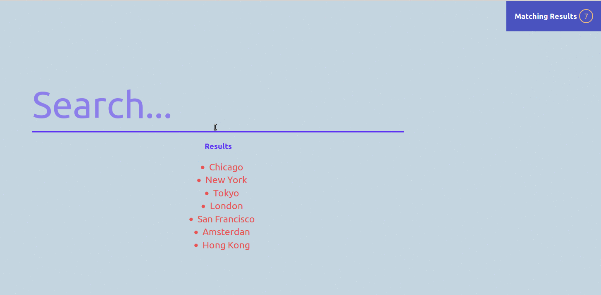

# React state

## Communicating between components.

### Demo 1 - Basic

#### Components:

+ `<ListContainer />`
+ `<Filter />`
+ `<List />`
+ `<MatchedResults />`

**This stater-repo is the complete solution. It should be explained in the whiteboard and learn the whole functionality, and then use `create-react-app` from scratch to show step by step the development.**
